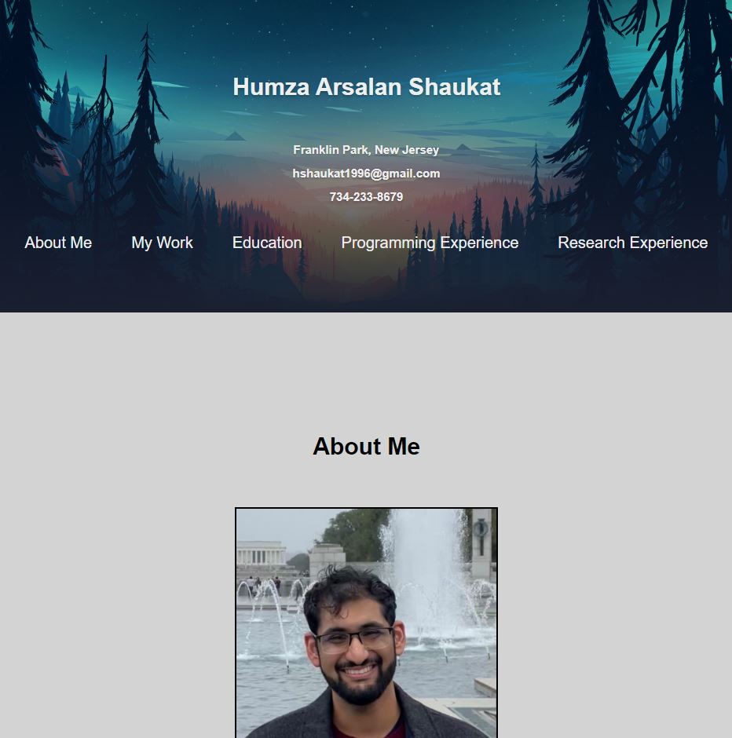
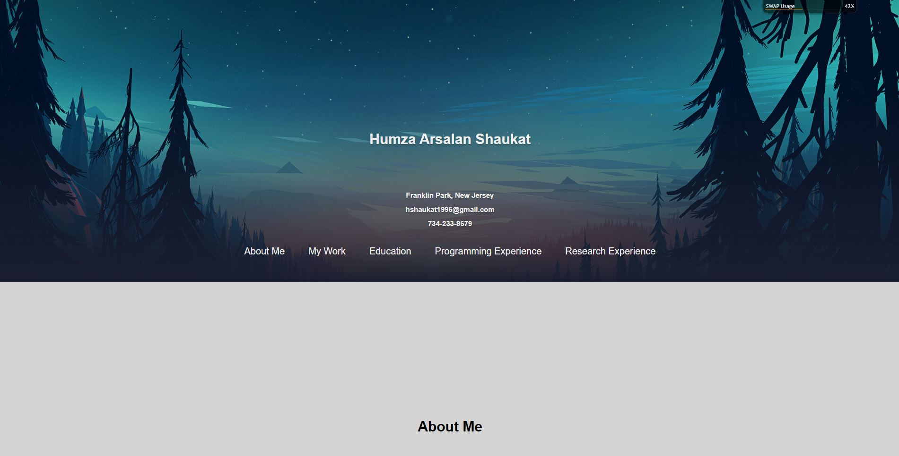

# MyPortfolio

## Description

This project is my own portfolio.  Not only does it serve as my CV and portofio to potential employers, but it also demonstrates some of my skills in CSS, HTML, and, later, Javascript.  As of now, it contains a lot of information and skills I have learned in this course such as utilizing flex properties to make a webpage more responsive, defining different properties to design the webpage by styling elements, classes, and IDs, and creating semantically correct HTML skeletons to better style with CSS.

## Usage

The web application is a responsively designed CV and portfolio that gives a comprehensive, professional overview of the author, Humza Shaukat.  The images in the "My Work" section serve as links to the projects the author has created with the first project showing up larger at everypoint.  The webpage can be resized and will change to dynamically fit the new screen size.  

The site can be found here: [github](https://humzashaukat.github.io/MyPortfolio/)

## Mock-Up

Here are three screenshots of the working webpage at different size browser windows:

## Credits

N/A

## License

MIT License